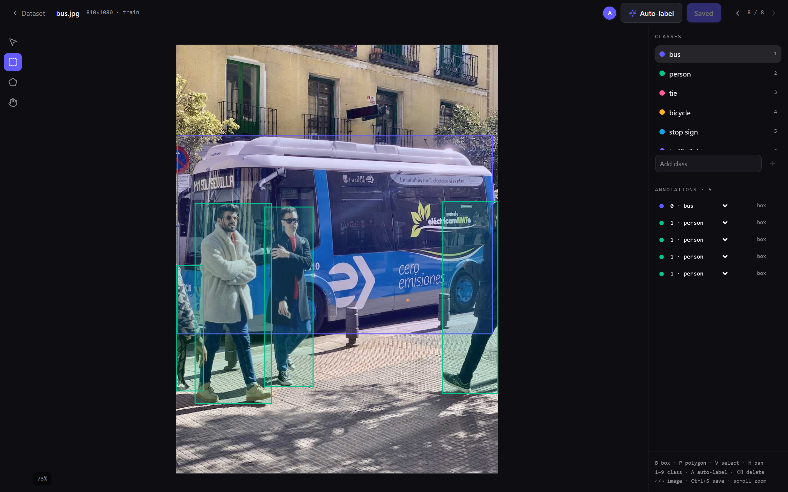
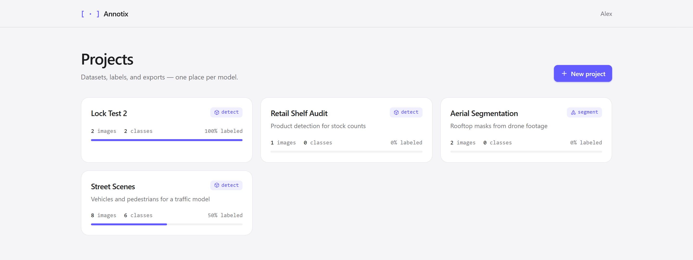
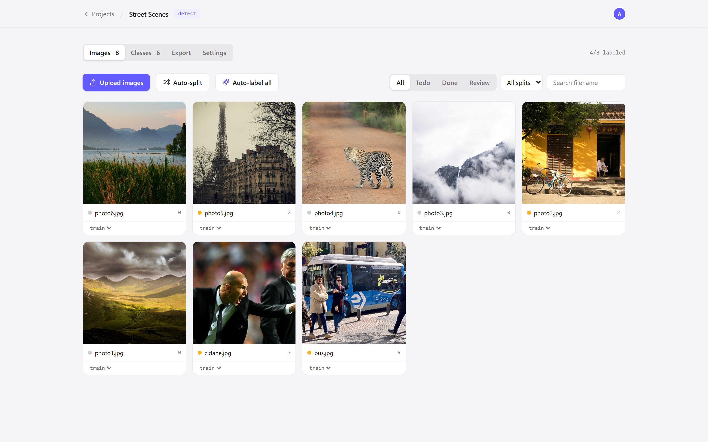

<div align="center">

# `[ · ]` Annotix

**Open-source image annotation for YOLO — with auto-labeling built in.**

Draw boxes and polygons, label together in real time, press <kbd>A</kbd> to let a
baseline model pre-label for you, and export straight to YOLO (v5 → v11 → YOLO26)
or COCO. Self-hosted, one binary, no accounts to create.

[](https://github.com/szyxxx/Annotix/actions/workflows/ci.yml)
[](LICENSE)
[](server)
[](frontend)
[](CONTRIBUTING.md)



</div>

## Why Annotix

Tools like Roboflow are excellent but hosted and metered; Label Studio is
flexible but heavy to run. Annotix is the small, fast middle: a **single Rust
binary** that serves the UI, API, and your data from one folder on your own
machine — plus an optional Python sidecar that auto-labels images with a YOLO11
baseline model so you start from predictions instead of a blank canvas.

## Features

- 🎯 **Bounding boxes & polygon segmentation** — fast SVG editor with zoom/pan, vertex editing, class reassignment, and keyboard-first workflow
- ✨ **Class-locked auto-labeling** — the model is prompted with *your* class list (open-vocabulary YOLOE), so it looks for exactly your classes — any nameable object, not just COCO's 80. No classes yet? It bootstraps them from what it finds. One image (<kbd>A</kbd>) or the whole dataset in one click, and editing the class list re-labels automatically — human-annotated images are never touched
- 👥 **Real-time collaboration** — live presence avatars, "who's editing what", instant updates over WebSocket; teammates just open your URL
- 🗂️ **Project & dataset management** — multi-file upload, train/val/test splits with one-click auto-split (70/20/10), statuses, filename search
- 📦 **Export that trains** — YOLO detect & segment (`data.yaml` + normalized `.txt`, the format shared by YOLOv5 through YOLO11 and YOLO26) and COCO JSON, zipped per split
- 🪶 **Zero-infra self-hosting** — SQLite + local disk in `data/`, no external services, Apache-2.0

<table>
  <tr>
    <td></td>
    <td></td>
  </tr>
  <tr>
    <td align="center"><sub>Projects dashboard</sub></td>
    <td align="center"><sub>Dataset management — splits, statuses, search</sub></td>
  </tr>
</table>

## Quick start

### Docker (easiest)

```sh
git clone https://github.com/szyxxx/Annotix.git && cd Annotix
docker compose up --build
```

Open **http://localhost:8000** — that's it. Add auto-labeling (a ~2 GB
PyTorch-CPU image) with:

```sh
docker compose --profile ml up --build
```

### From source

Prerequisites: [Rust](https://rustup.rs), [Node 20+](https://nodejs.org), and
(only for auto-labeling) [uv](https://docs.astral.sh/uv/).

```sh
# UI + server → http://localhost:8000
cd frontend && npm install && npm run build
cd ../server && cargo run --release

# optional: auto-label sidecar
# (first class-locked prediction downloads model weights + text encoder, ~600 MB, once)
cd ../ml && uv sync && uv run uvicorn main:app --port 8100
```

Then open http://localhost:8000, claim a display name, create a project, drop
images in, and annotate. Teammates on your network open the same URL and appear
in the presence bar.

## The workflow

1. **Create a project** — bounding boxes or segmentation.
2. **Add your classes** — auto-label locks onto exactly these names (e.g. `helmet`,
   `forklift`, `pallet`), thanks to an open-vocabulary model. Skip this and it
   bootstraps classes from whatever it detects.
3. **Upload images** — drag & drop; splits default to `train`, auto-split anytime.
4. **Auto-label all** — then review and fix, instead of drawing from scratch.
   Update the class list later and unreviewed images re-label themselves.
5. **Export** — a zip you can point Ultralytics at directly:

```sh
yolo train data=path/to/export/data.yaml model=yolo11n.pt
```

## Editor shortcuts

| Key | Action | Key | Action |
|-----|--------|-----|--------|
| <kbd>B</kbd> | Box tool | <kbd>A</kbd> | Auto-label |
| <kbd>P</kbd> | Polygon tool | <kbd>Del</kbd> | Delete selected |
| <kbd>V</kbd> | Select / edit | <kbd>←</kbd> <kbd>→</kbd> | Prev / next image (auto-saves) |
| <kbd>H</kbd> / <kbd>Space</kbd> | Pan | <kbd>Ctrl+S</kbd> | Save |
| <kbd>1–9</kbd> | Pick class | scroll | Zoom |

## Architecture

| Directory | What it is |
|-----------|------------|
| [`frontend/`](frontend) | React 19 + Vite + Tailwind v4 |
| [`server/`](server) | Rust (Axum + SQLite) — API, WebSocket hub, storage, export. Serves the built UI too |
| [`ml/`](ml) | Python (FastAPI + ultralytics) auto-label sidecar — optional |

Design details, API surface, and deliberate MVP trade-offs: [docs/PLAN.md](docs/PLAN.md).

## Roadmap

Dataset versioning & snapshots · review/approve workflow · training jobs ·
augmentation on export · real auth & orgs · S3 storage · active learning
(train on approved labels → auto-label the rest with your own model).

Contributions welcome — see [CONTRIBUTING.md](CONTRIBUTING.md).

## License

[Apache-2.0](LICENSE)
