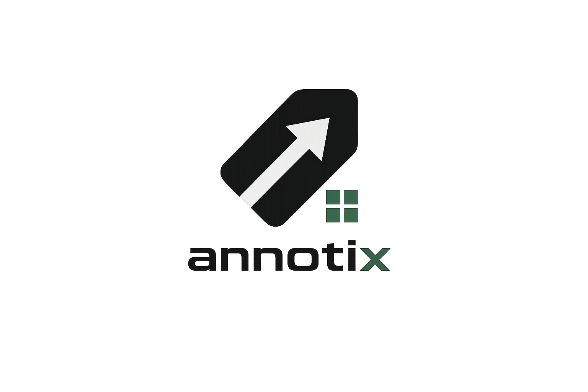
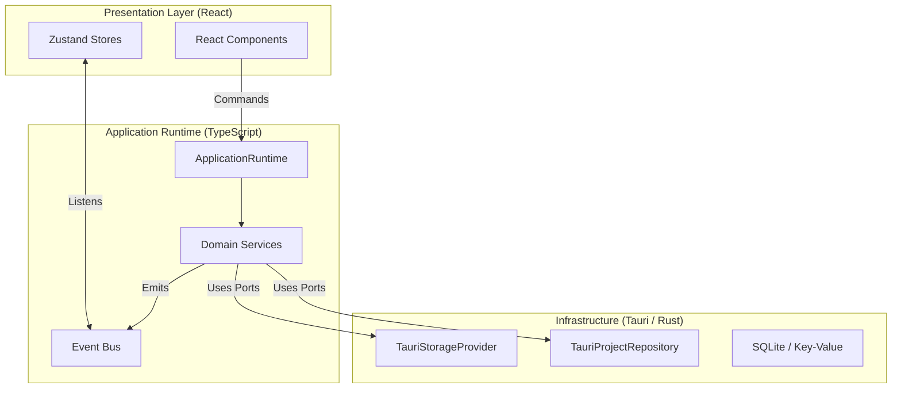

<div align="center">
  
  <h1>Annotix</h1>
  <p><strong>The Open-Source, Offline-First Computer Vision Dataset Platform</strong></p>
</div>

<br />


## What is Annotix?

Annotix is a next-generation desktop application designed for AI/ML engineers, data scientists, and researchers to manage, annotate, and process computer vision datasets. 

Unlike web-based tools that struggle with massive datasets or require complex cloud deployments, Annotix runs natively on your machine, leveraging local hardware and true offline-first capabilities.

### Why Annotix?

| Feature | Annotix | Web-Based Tools (CVAT / Label Studio) |
| ------- | ------- | ------------------------------------- |
| **Architecture** | Native Desktop (Tauri + Rust) | Web Service / Docker required |
| **Connectivity** | 100% Offline | Requires server / network connection |
| **Performance** | Native File I/O & WebGPU | Browser Sandbox Constraints |
| **Data Privacy** | Stays on your disk | Uploads required (S3/Cloud) |
| **Extensibility** | WebAssembly Plugins (Coming) | Custom Python backends |

---

## Key Features

* **Offline First:** Your data never leaves your machine. No cloud uploads, no S3 buckets required.
* **Native Desktop:** Built with Tauri, Rust, and React for native OS integration and blistering speed.
* **Smart Asset Pipeline:** Ingest, deduplicate (SHA-256), and generate optimized WebP thumbnails automatically.
* **AI Assisted (Roadmap):** Local inference via ONNX and WebNN for zero-latency bounding boxes and segmentation.
* **Plugin System (Roadmap):** Extend capabilities via secure WebAssembly plugins.

---

## Screenshots

### Workspace & Project Management


### Dataset Pipeline


*Canvas and AI Assisted annotation coming soon.*

---

## Roadmap

Annotix is actively developed with a clear progression path to v1.0.0.

- [x] **v0.1.0 Workspace Platform:** Core domain-driven design, local event bus, Rust/Tauri storage providers.
- [ ] **v0.2.0 Dataset & Asset Pipeline:** Granular import events, thumbnail generation, hash-based caching, robust grid views. *(Current Focus)*
- [ ] **v0.3.0 Canvas Engine:** WebGL/Canvas2D high-performance rendering for images and annotations.
- [ ] **v0.4.0 Annotation Tools:** Bounding boxes, polygons, keypoints, masks.
- [ ] **v0.5.0 AI Assist:** Local GroundingDINO/YOLO inference integration.
- [ ] **v0.6.0 Training & Export:** Export pipelines for YOLO, COCO, Pascal VOC.
- [ ] **v1.0.0 Production Release:** Plugin SDK, benchmarks, and stable API.

---

## Architecture Overview

Annotix follows a strict **Hexagonal Architecture (Ports and Adapters)** mixed with **Domain-Driven Design (DDD)**. 



For more details on our architectural decisions, see our [Architecture Decision Records (ADR)](docs/adr).

---

## Getting Started

### Prerequisites

* [Node.js](https://nodejs.org/) (v18+)
* [Rust](https://www.rust-lang.org/tools/install) (latest stable)
* Tauri Prerequisites (depending on your OS)

### Installation

1. **Clone the repository**
   ```bash
   git clone https://github.com/yourusername/annotix.git
   cd annotix
   ```

2. **Install dependencies**
   ```bash
   npm install
   ```

3. **Run in development mode**
   ```bash
   npm run tauri dev
   ```

---

## Contributing

We are building Annotix for the open-source community, and we'd love your help! 

Please read our [CONTRIBUTING.md](CONTRIBUTING.md) for details on our code of conduct, development environment setup, and the process for submitting pull requests.

Check out our issues labeled `good first issue` or `help wanted` to get started.

## License

This project is licensed under the MIT License - see the [LICENSE](LICENSE) file for details.
